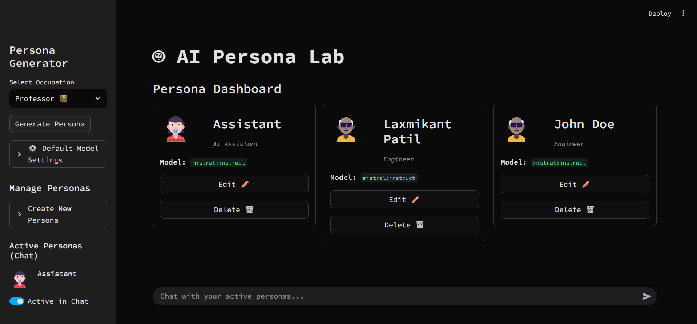

# 🤖 AI Persona Lab

[](https://www.python.org/downloads/)
[](https://streamlit.io)
[](https://ollama.ai/)

A powerful, local-first AI application for creating, managing, and simulating group chats with dynamic AI personalities.

This project features a modern, dark-mode "bot-lab" UI and a high-performance, asynchronous backend to handle simultaneous conversations with multiple AI agents powered by Ollama.

> **Note:** The screenshot below is from a previous version. Please update this image to reflect the new dark-mode UI and card-based dashboard!



## ✨ Key Features

* **⚡ Blazing-Fast Group Chat:** Asynchronous backend (`httpx` + `asyncio`) gets responses from *all* active personas simultaneously. No more waiting for bots to reply one-by-one.
* **🤖 Modern "Bot-Lab" UI:** A sleek, dark-mode theme designed for a futuristic, AI-centric feel (powered by `config.toml`).
* **📇 Visual Persona Dashboard:** A clean, scalable, card-based grid replaces tabs. View all your personas at a glance.
* **⚙️ Centralized Edit Dialog:** Click "Edit" on any persona card to open a single, focused dialog for modifying all their attributes.
* **🧬 Dynamic Persona Generation:** Instantly create new AI personas with unique backgrounds, personalities, and skills using an occupation-based prompt.
* **🧠 Per-Persona Model Settings:** Assign different Ollama models (e.g., `mistral`, `llama3`, `gemma`) and tune parameters (temperature, tokens) for *each individual persona*.
* **💾 Persistent Storage:** All personas and settings are saved locally in the `data/` directory.

---

## Requirements

* Python 3.8+
* [Ollama](https://ollama.ai/) server running locally
* Required Python packages (see `requirements.txt` setup below)

---

## 🚀 Installation

1.  **Install Ollama:**
    Follow the instructions at [ollama.ai](https://ollama.ai) to download and install the Ollama server.

2.  **Clone the Repository:**
    ```bash
    git clone [https://github.com/PatilLaxmikant/AI-Persona-Lab.git)
    cd ai-persona-lab
    ```

3.  **Set Up Dependencies:**
    Create a file named `requirements.txt` in the project root:

    **`requirements.txt`**
    ```
    streamlit
    requests
    pydantic
    httpx
    ```

    Then, install the dependencies:
    ```bash
    pip install -r requirements.txt
    ```

4.  **Start Ollama & Pull Models:**
    First, start the Ollama server in your terminal:
    ```bash
    ollama serve
    ```

    Then, in a separate terminal, pull the models you want to use. `mistral` is a great one to start with:
    ```bash
    ollama pull mistral:instruct
    ```

---

## 🖥️ Usage

1.  **Start the Application:**
    ```bash
    streamlit run app.py
    ```
    This will open the AI Persona Lab in your web browser.

2.  **Create Personas:**
    * Use the **"Persona Generator"** in the sidebar to create new personas.
    * You can select a predefined occupation or enter a custom one.
    * The "Default Model Settings" in the sidebar will be used to generate new personas.

3.  **Manage Personas:**
    * All your created personas will appear on the **"Persona Dashboard"** as cards.
    * Click the **"Edit ✏️"** button on any card to open a dialog and modify all details (name, background, personality, model settings, etc.).
    * Click **"Delete 🗑️"** to remove a persona.

4.  **Start a Group Chat:**
    * Use the **"Active Personas (Chat)"** toggles in the sidebar to select which personas you want to talk to.
    * Go to the **"Group Chat"** area at the bottom of the page and type your message.
    * All active personas will respond simultaneously, with their replies appearing in the chat as they are generated.

---

## 📁 Project Structure

```
ai-persona-lab/
├── app.py              # Main Streamlit application and UI
├── streamlit/
│   └── config.toml      # Bot theme 
├── models/
│   └── persona.py      # Persona class and management logic
├── chat/
│   └── interface.py    # Chat interface and message handling
├── data/               # Storage for personas and chat history
├── requirements.txt    # Python dependencies
└── README.md          # Documentation
```
---

## 🔧 Configuration

### UI Theme
The "Bot-Lab" theme is defined in `.streamlit/config.toml`. You can edit this file to change the app's colors, fonts, and more.

### Default Settings
* **Default Persona Settings:** Change the default model, temperature, and tokens for *newly generated* personas using the "Default Model Settings" expander in the UI.
* **Ollama API URL:** The app connects to `http://127.0.0.1:11434/api` by default. This is hard-coded in `models/persona.py` and `chat/interface.py`.

---

## 💡 Troubleshooting

1.  **Connection Error (Chat):**
    * Ensure the Ollama server is running (`ollama serve`).
    * If you see an error in the chat bubble, it often means the connection to Ollama failed. Check your terminal for `ollama serve` logs.

2.  **Model Loading Issues:**
    * Ensure you have pulled the model you are trying to use: `ollama pull mistral:instruct`.
    * Check available models with: `ollama list`.
    * The model name in the app *must* match the name in `ollama list` exactly (e.g., `mistral:instruct`).

3.  **UI Issues / App Crash:**
    * Clear your browser cache and restart the Streamlit server.
    * Check the terminal running `streamlit run app.py` for tracebacks.

---

## 🤝 Contributing

Contributions are welcome! Please:

1.  Fork the repository.
2.  Create a feature branch (`git checkout -b feature/AmazingFeature`).
3.  Make your changes.
4.  Commit your changes (`git commit -m 'Add some AmazingFeature'`).
5.  Push to the branch (`git push origin feature/AmazingFeature`).
6.  Open a Pull Request.

---


* [Ollama](https://ollama.ai/) for the amazing local LLM server.
* [Streamlit](https://streamlit.io/) for the powerful UI framework.
* [httpx](https://www.python-httpx.org/) for high-performance async requests.
